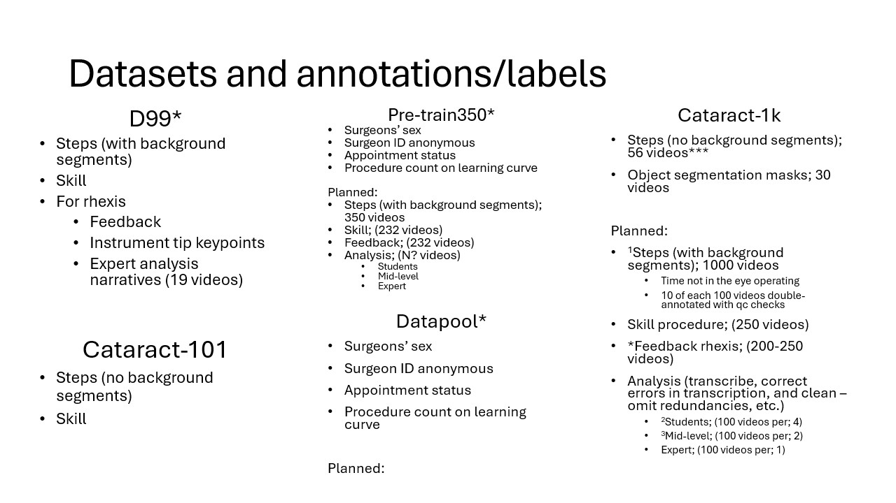

# Multimodal Large Language Models for Healthcare

## Introduction

This project aims to explore the use of multimodal large language models (LLMs) in healthcare. The project will focus on the application of multimodal LLMs in the analysis of cataract surgery videos. The project will involve the use of multimodal LLMs to analyze cataract surgery videos and extract information from the videos. The project will also involve the development of a dataset of cataract surgery videos for training and evaluation of the multimodal LLMs.

## Metadata

- **Author**: [Angad Sandhu]
- **Date**: 2022-02-14
- **Keywords**: multimodal LLMs, healthcare, cataract surgery videos
- **Tags**: multimodal LLMs, healthcare, cataract surgery videos
- **Categories**: multimodal LLMs, healthcare, cataract surgery videos

## Reading

1. [Cataract-1K Dataset for Deep-Learning-Assisted Analysis of Cataract Surgery Videos](./reading/Cataract-1K%20Dataset.pdf)
2. [Hierarchical Video-Language Pretraining for Zero-shot Surgical Phase Recognition](./reading/HecVL.pdf)
3. [A Survey on Transfer Learning](./reading/MLLM%20Survey.pdf)
4. <https://github.com/Vision-CAIR/MiniGPT4-video>

DATA:

Pre-Trained Models:

<!-- - MiniCPM: <https://huggingface.co/spaces/openbmb/MiniCPM-Llama3-V-2_5> -->
- Uni-MoE: <https://github.com/HITsz-TMG/UMOE-Scaling-Unified-Multimodal-LLMs>
- MiniGPT-video: <https://github.com/Vision-CAIR/MiniGPT4-video>
- LLAVA-1.6: <https://llava.hliu.cc/>
- ml-ferret: <https://github.com/apple/ml-ferret>
